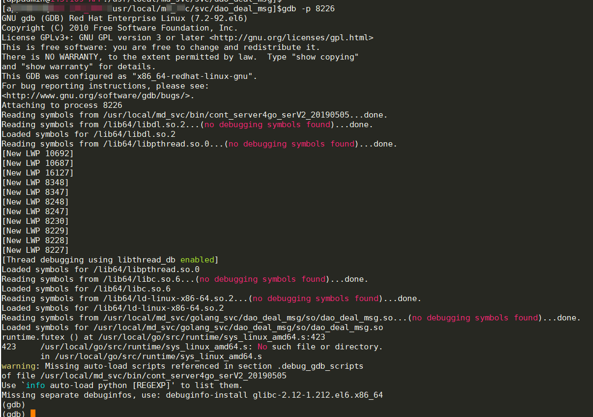
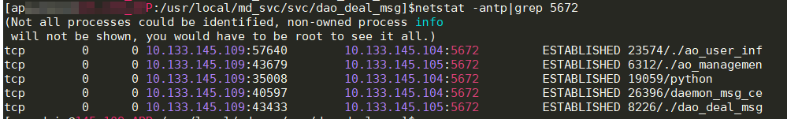
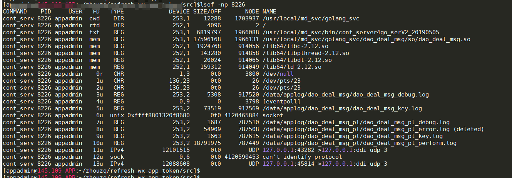

## 背景

最近在用 go 重构 c++ 订单发消息服务，使用 rabbitmq 组件发消息，其中想测试一种异常情况：订单发消息服务与 rabbitmq 断开 socket 连接时，服务是否会重连，并正常发消息。

## 模拟在线关闭一个 TCP Socket 连接

如果要你在线关闭一个 TCP Socket 连接，或许你会说这很简单呀，`netstat -antp` 找到连接，`kill` 掉这个进程就行了。如下：

```bash
# netstat -antp|grep 5672
tcp        0      0 10.133.145.109:43433        10.133.145.105:5672         ESTABLISHED 8226/./dao_deal_msg
# kill 8226
```

基于以上操作，连接确实关掉了，进程也跟着一起杀死了。但是这一波操作达不到 “在线” 的要求。

想一下有没有办法在不杀死进程的条件下，还是可以关闭 Socket 连接呢？

答案是当然的。我们知道，在编码的时候，要关闭一个 Socket，只要调用 close 函数就可以了，但是进程在运行着的时候，该怎么样操作，才能让它调用 close 呢？

看以下操作就知道了，原理就是 gdb attach 到进程上下文，然后执行 `call close($fd)`。

### 首先使用 `netstat` 找到相应的进程，比如我这里找的是订单发消息服务连接 mq 的 socket 进程，mq 端口号为 5672：

```bash
# netstat -antp|grep 5672
tcp        0      0 10.133.145.109:43433        10.133.145.105:5672         ESTABLISHED 8226/./dao_deal_msg
```

可以看到上面的进程 pid 为 8226。

### 然后使用 lsof 找到进程 8226 打开的所有文件描述符，并找到对应的 Socket 连接，如下：

```bash
# lsof -np 8226
COMMAND    PID     USER   FD   TYPE             DEVICE SIZE/OFF       NODE NAME
cont_serv 8226 appadmin   12u  IPv4         4120590453      0t0        TCP 10.133.145.109:43433->10.133.145.105:amqp (ESTABLISHED)
```

其中 12u 就是上面对应 Socket 连接的文件描述符。

### 接着 gdb 连接到 PID 为 8226 的进程

```bash
# gdb -p 8226
```

gdb 进入到进程如下所示：



### 最后关闭 `12u` Socket 连接（文件描述符）

```bash
# call close(12u)
```

关闭 socket 后，再看下进程是否还存在，以及 `12u` 的 socket 连接是否已经不在了，如下：




可以看到 Socket 连接已经关闭了，但是进程 8226 还是好着的。

### 用的场景

你可能会问，什么时候会用到这个特性呢？场景还是比较多的，比如你想测试下应用是否会自动重连 MySQL 或者 rabbitmq，通过这个办法就可以比较方便的测试了，我这里就是用来测试服务是否重连 rabbitmq 的。
